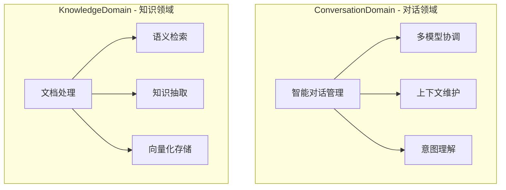
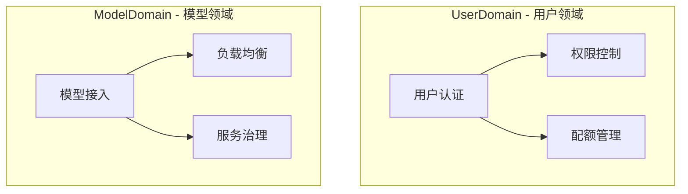

# AgentU 后端设计文档

## 1. 项目概述

### 1.1 产品定位
AgentU 是一个企业级通用型AI助手平台，旨在为企业和开发者提供多模型集成、知识库增强、工具调用能力的一站式AI解决方案。

### 1.2 核心业务价值
**提供智能化的问答和任务执行服务**，通过以下业务流程实现价值：
- 用户提出问题或任务 → AI理解并分析 → 调用知识库/工具 → 生成回答/执行结果
- 企业上传知识文档 → 文档处理和索引 → 知识库增强AI能力

### 1.3 技术栈选择
- **框架**：Spring Boot 3.x + Spring AI
- **数据库**：PostgreSQL 15+ + pgvector
- **缓存**：Redis 7.x
- **消息队列**：RabbitMQ 3.x
- **容器化**：Docker + Docker Compose

## 2. DDD领域架构设计

### 2.1 界限上下文识别

基于业务价值链分析，识别出四个核心领域：

#### 核心领域 (Core Domain)


#### 支撑领域 (Supporting Domain)


### 2.2 四层架构设计

```
┌─────────────────────────────────────────┐
│          表现层 (Presentation)            │  REST API、GraphQL、WebSocket
├─────────────────────────────────────────┤
│           应用层 (Application)            │  用例编排、事务管理、安全控制
├─────────────────────────────────────────┤
│            领域层 (Domain)               │  业务逻辑、领域模型、业务规则
├─────────────────────────────────────────┤
│          基础设施层 (Infrastructure)       │  数据持久化、外部服务、技术实现
└─────────────────────────────────────────┘
```

## 3. 领域模型设计

### 3.1 对话领域 (ConversationDomain)

#### 聚合根：Session (会话)
```java
@Entity
@AggregateRoot
public class Session {
    private SessionId id;
    private UserId userId;
    private String title;
    private SessionStatus status;
    private ModelConfig modelConfig;
    private List<Conversation> conversations;
    private LocalDateTime createdAt;
    private LocalDateTime lastMessageAt;
    
    // 业务行为
    public void sendMessage(MessageContent content) {
        validateCanSendMessage();
        Conversation conversation = Conversation.createUserMessage(content);
        conversations.add(conversation);
        updateLastMessageTime();
        
        // 发布领域事件
        DomainEventPublisher.raise(new MessageSentEvent(id, conversation.getId()));
    }
    
    public void addAiResponse(AiResponse response) {
        validateCanAddResponse();
        Conversation conversation = Conversation.createAiMessage(response);
        conversations.add(conversation);
        updateStatistics(response.getTokenUsage());
        
        // 发布领域事件
        DomainEventPublisher.raise(new AiResponseGeneratedEvent(id, conversation.getId(), response));
    }
    
    private void validateCanSendMessage() {
        if (status == SessionStatus.ARCHIVED) {
            throw new SessionArchivedException(id);
        }
    }
}
```

#### 实体：Conversation (对话消息)
```java
@Entity
public class Conversation {
    private ConversationId id;
    private SessionId sessionId;
    private MessageRole role;
    private MessageContent content;
    private Integer sequenceNumber;
    private ModelInvocation modelInvocation; // 仅AI消息
    private TokenUsage tokenUsage; // 仅AI消息
    private LocalDateTime createdAt;
    
    public static Conversation createUserMessage(MessageContent content) {
        return new Conversation(
            ConversationId.generate(),
            MessageRole.USER,
            content,
            null, // 无模型调用
            null  // 无token使用
        );
    }
    
    public static Conversation createAiMessage(AiResponse response) {
        return new Conversation(
            ConversationId.generate(),
            MessageRole.ASSISTANT,
            response.getContent(),
            response.getModelInvocation(),
            response.getTokenUsage()
        );
    }
}
```

#### 值对象设计
```java
// 会话ID
public record SessionId(String value) {
    public SessionId {
        Objects.requireNonNull(value);
        if (value.trim().isEmpty()) {
            throw new IllegalArgumentException("SessionId不能为空");
        }
    }
    
    public static SessionId generate() {
        return new SessionId(UUID.randomUUID().toString());
    }
}

// 消息内容
public record MessageContent(String text, ContentType type) {
    public MessageContent {
        Objects.requireNonNull(text);
        if (text.trim().isEmpty()) {
            throw new IllegalArgumentException("消息内容不能为空");
        }
    }
    
    public static MessageContent text(String text) {
        return new MessageContent(text, ContentType.TEXT);
    }
}

// Token使用情况
public record TokenUsage(int inputTokens, int outputTokens) {
    public TokenUsage {
        if (inputTokens < 0 || outputTokens < 0) {
            throw new IllegalArgumentException("Token数量不能为负数");
        }
    }
    
    public int getTotalTokens() {
        return inputTokens + outputTokens;
    }
}

// 模型配置
public record ModelConfig(
    ModelId modelId,
    ProviderId providerId,
    Temperature temperature,
    Integer maxTokens,
    Boolean enableKnowledgeBase,
    List<KnowledgeBaseId> knowledgeBaseIds
) {
    public ModelConfig {
        Objects.requireNonNull(modelId);
        Objects.requireNonNull(providerId);
    }
}
```

### 3.2 知识领域 (KnowledgeDomain)

#### 聚合根：KnowledgeBase (知识库)
```java
@Entity
@AggregateRoot
public class KnowledgeBase {
    private KnowledgeBaseId id;
    private UserId userId;
    private String name;
    private String description;
    private EmbeddingConfig embeddingConfig;
    private List<Document> documents;
    private KnowledgeBaseStatus status;
    private KnowledgeBaseStatistics statistics;
    private LocalDateTime createdAt;
    
    // 业务行为
    public void uploadDocument(DocumentUploadRequest request) {
        validateCanUploadDocument(request);
        
        Document document = Document.create(
            id, 
            request.getFileName(), 
            request.getFileContent(),
            request.getFileType()
        );
        
        documents.add(document);
        
        // 发布领域事件
        DomainEventPublisher.raise(new DocumentUploadedEvent(id, document.getId()));
    }
    
    public SearchResult search(SearchQuery query, int limit) {
        validateCanSearch();
        
        // 通过领域服务执行向量搜索
        List<DocumentChunk> relevantChunks = knowledgeSearchService.search(
            id, 
            query, 
            embeddingConfig.getModel(),
            limit
        );
        
        // 发布领域事件
        DomainEventPublisher.raise(new KnowledgeSearchedEvent(id, query, relevantChunks.size()));
        
        return new SearchResult(query, relevantChunks);
    }
    
    private void validateCanUploadDocument(DocumentUploadRequest request) {
        if (status != KnowledgeBaseStatus.ACTIVE) {
            throw new KnowledgeBaseNotActiveException(id);
        }
        
        if (statistics.getTotalSize() + request.getFileSize() > MAX_STORAGE_SIZE) {
            throw new StorageQuotaExceededException(id);
        }
    }
}
```

#### 实体：Document (文档)
```java
@Entity
public class Document {
    private DocumentId id;
    private KnowledgeBaseId knowledgeBaseId;
    private String fileName;
    private String originalName;
    private FileType fileType;
    private Long fileSize;
    private DocumentContent content;
    private ProcessingStatus processingStatus;
    private List<DocumentChunk> chunks;
    private LocalDateTime createdAt;
    
    public void process() {
        this.processingStatus = ProcessingStatus.PROCESSING;
        
        // 通过领域服务处理文档
        DocumentProcessingResult result = documentProcessingService.process(this);
        
        // 创建文档片段
        this.chunks = result.getChunks().stream()
            .map(chunkContent -> DocumentChunk.create(id, chunkContent))
            .collect(Collectors.toList());
        
        this.processingStatus = ProcessingStatus.COMPLETED;
        
        // 发布领域事件
        DomainEventPublisher.raise(new DocumentProcessedEvent(id, knowledgeBaseId, chunks.size()));
    }
}
```

#### 实体：DocumentChunk (文档片段)
```java
@Entity
public class DocumentChunk {
    private ChunkId id;
    private DocumentId documentId;
    private KnowledgeBaseId knowledgeBaseId;
    private Integer chunkIndex;
    private ChunkContent content;
    private Vector embedding;
    private ChunkMetadata metadata;
    private Integer searchCount;
    private LocalDateTime lastSearchedAt;
    
    public void recordSearch() {
        this.searchCount++;
        this.lastSearchedAt = LocalDateTime.now();
    }
}
```

#### 领域服务：KnowledgeSearchService
```java
@DomainService
public class KnowledgeSearchService {
    private final VectorStoreService vectorStoreService;
    private final EmbeddingService embeddingService;
    
    public List<DocumentChunk> search(
            KnowledgeBaseId knowledgeBaseId,
            SearchQuery query,
            EmbeddingModel model,
            int limit) {
        
        // 生成查询向量
        Vector queryVector = embeddingService.embed(query.getText(), model);
        
        // 执行向量相似度搜索
        List<SimilarityResult> similarityResults = vectorStoreService.searchSimilar(
            knowledgeBaseId,
            queryVector,
            limit
        );
        
        // 转换为文档片段
        return similarityResults.stream()
            .map(result -> result.getDocumentChunk())
            .collect(Collectors.toList());
    }
}
```

### 3.3 用户领域 (UserDomain)

#### 聚合根：User (用户)
```java
@Entity
@AggregateRoot
public class User {
    private UserId id;
    private Username username;
    private Email email;
    private PasswordHash passwordHash;
    private UserProfile profile;
    private UserStatus status;
    private UserPreferences preferences;
    private UsageQuota quota;
    private List<ApiKeyConfig> apiKeys;
    private SecurityInfo securityInfo;
    private LocalDateTime createdAt;
    
    // 业务行为
    public void authenticate(Password password) {
        if (status == UserStatus.LOCKED) {
            throw new UserAccountLockedException(id);
        }
        
        if (!passwordHash.matches(password)) {
            securityInfo.recordFailedLogin();
            if (securityInfo.shouldLockAccount()) {
                this.status = UserStatus.LOCKED;
                DomainEventPublisher.raise(new UserAccountLockedEvent(id));
            }
            throw new InvalidPasswordException();
        }
        
        securityInfo.recordSuccessfulLogin();
        DomainEventPublisher.raise(new UserAuthenticatedEvent(id));
    }
    
    public void addApiKey(ApiKeyConfig apiKeyConfig) {
        validateCanAddApiKey(apiKeyConfig);
        apiKeys.add(apiKeyConfig);
        DomainEventPublisher.raise(new ApiKeyAddedEvent(id, apiKeyConfig.getProviderId()));
    }
    
    public void consumeTokens(int tokens) {
        if (!quota.canConsume(tokens)) {
            throw new QuotaExceededException(id, tokens);
        }
        quota.consume(tokens);
    }
    
    private void validateCanAddApiKey(ApiKeyConfig config) {
        long existingKeysForProvider = apiKeys.stream()
            .filter(key -> key.getProviderId().equals(config.getProviderId()))
            .count();
        
        if (existingKeysForProvider >= MAX_API_KEYS_PER_PROVIDER) {
            throw new TooManyApiKeysException(id, config.getProviderId());
        }
    }
}
```

### 3.4 模型领域 (ModelDomain)

#### 聚合根：AiProvider (AI服务提供商)
```java
@Entity
@AggregateRoot
public class AiProvider {
    private ProviderId id;
    private String providerName;
    private String providerCode;
    private ProviderConfig config;
    private ServiceType serviceType;
    private List<AiModel> models;
    private ProviderStatus status;
    private RateLimitConfig rateLimitConfig;
    private OfficialServiceConfig officialConfig; // 官方服务配置
    
    // 业务行为
    public ModelInvocationResult invokeModel(ModelInvocationRequest request) {
        validateCanInvokeModel(request);
        
        AiModel model = findModel(request.getModelId());
        ApiKeyConfig apiKey = selectApiKey(request.getUserId(), request.getServicePreference());
        
        // 检查速率限制
        if (!rateLimitConfig.canInvoke(request.getUserId())) {
            throw new RateLimitExceededException(id, request.getUserId());
        }
        
        // 执行模型调用
        ModelInvocationResult result = modelInvokerService.invoke(model, apiKey, request);
        
        // 记录使用情况
        recordUsage(request.getUserId(), apiKey.getKeyType(), result.getTokenUsage());
        
        // 发布领域事件
        DomainEventPublisher.raise(new ModelInvokedEvent(id, model.getId(), result));
        
        return result;
    }
    
    private ApiKeyConfig selectApiKey(UserId userId, ServicePreference preference) {
        // 根据用户偏好选择API密钥：官方免费 > 用户自备 > 官方付费
        return switch (preference) {
            case OFFICIAL_FREE -> findOfficialFreeKey(userId);
            case USER_PROVIDED -> findUserProvidedKey(userId);
            case OFFICIAL_PAID -> findOfficialPaidKey(userId);
            case AUTO -> selectBestAvailableKey(userId);
        };
    }
}
```

## 4. 领域事件编排

### 4.1 核心业务流程事件

#### 智能对话流程
```java
// 事件序列
public class ConversationFlow {
    
    @EventHandler
    public void handleMessageSent(MessageSentEvent event) {
        // 1. 分析用户意图
        IntentAnalysisResult intent = intentAnalysisService.analyze(event.getMessage());
        
        // 2. 如果需要知识库检索
        if (intent.requiresKnowledgeSearch()) {
            knowledgeSearchService.searchRelevantContent(
                event.getSessionId(),
                intent.getSearchQuery()
            );
        }
        
        // 3. 触发AI回复生成
        aiResponseService.generateResponse(event.getSessionId(), event.getMessageId());
    }
    
    @EventHandler
    public void handleKnowledgeSearchCompleted(KnowledgeSearchCompletedEvent event) {
        // 使用检索到的知识增强上下文，继续AI回复生成
        aiResponseService.enhanceContextAndGenerate(
            event.getSessionId(),
            event.getSearchResults()
        );
    }
    
    @EventHandler
    public void handleAiResponseGenerated(AiResponseGeneratedEvent event) {
        // 1. 更新会话统计
        sessionStatisticsService.updateStatistics(event.getSessionId(), event.getTokenUsage());
        
        // 2. 更新用户配额
        userQuotaService.consumeTokens(event.getUserId(), event.getTokenUsage());
        
        // 3. 记录模型使用情况
        modelUsageService.recordUsage(event.getModelId(), event.getTokenUsage());
    }
}
```

#### 知识库处理流程
```java
public class KnowledgeProcessingFlow {
    
    @EventHandler
    public void handleDocumentUploaded(DocumentUploadedEvent event) {
        // 异步处理文档
        documentProcessingService.processAsync(event.getDocumentId());
    }
    
    @EventHandler
    public void handleDocumentProcessed(DocumentProcessedEvent event) {
        // 1. 生成向量嵌入
        embeddingGenerationService.generateEmbeddings(
            event.getDocumentId(),
            event.getChunks()
        );
        
        // 2. 更新知识库统计
        knowledgeBaseStatisticsService.updateStatistics(
            event.getKnowledgeBaseId(),
            event.getChunkCount()
        );
    }
    
    @EventHandler  
    public void handleEmbeddingsGenerated(EmbeddingsGeneratedEvent event) {
        // 1. 更新向量索引
        vectorIndexService.updateIndex(event.getKnowledgeBaseId(), event.getEmbeddings());
        
        // 2. 标记文档处理完成
        documentService.markAsReady(event.getDocumentId());
        
        // 3. 通知用户
        notificationService.notifyDocumentReady(event.getUserId(), event.getDocumentId());
    }
}
```

### 4.2 系统级事件

#### 用户认证和授权事件
```java
public class SecurityEventFlow {
    
    @EventHandler
    public void handleUserAuthenticated(UserAuthenticatedEvent event) {
        // 记录登录历史
        loginHistoryService.recordLogin(event.getUserId());
        
        // 更新最后登录时间
        userService.updateLastLoginTime(event.getUserId());
    }
    
    @EventHandler
    public void handleUserAccountLocked(UserAccountLockedEvent event) {
        // 发送安全警报邮件
        emailService.sendSecurityAlert(event.getUserId());
        
        // 记录安全事件
        securityAuditService.recordSecurityEvent(event);
    }
}
```

#### 配额管理事件
```java
public class QuotaManagementFlow {
    
    @EventHandler
    public void handleTokensConsumed(TokensConsumedEvent event) {
        // 检查配额使用率
        if (quotaService.getUsageRate(event.getUserId()) > 0.9) {
            // 发送配额警告
            notificationService.sendQuotaWarning(event.getUserId());
        }
    }
    
    @EventHandler
    public void handleQuotaExceeded(QuotaExceededEvent event) {
        // 暂停用户服务
        userService.suspendService(event.getUserId());
        
        // 发送配额超限通知
        notificationService.sendQuotaExceededNotification(event.getUserId());
    }
}
```

## 5. 技术架构设计

### 5.1 Spring Boot应用架构

```java
@SpringBootApplication
@EnableJpaRepositories(basePackages = "com.agentu.*.infrastructure.repository")
@EnableSpringAI
public class AgentUApplication {
    public static void main(String[] args) {
        SpringApplication.run(AgentUApplication.class, args);
    }
}
```

### 5.2 Spring AI集成

#### AI服务配置
```java
@Configuration
@EnableConfigurationProperties({OpenAiProperties.class, AnthropicProperties.class})
public class AiServiceConfiguration {
    
    @Bean
    @Primary
    public ChatClient multiModelChatClient(
            List<ChatClient> chatClients,
            ModelRoutingService modelRoutingService) {
        return new MultiModelChatClient(chatClients, modelRoutingService);
    }
    
    @Bean
    @ConditionalOnProperty("spring.ai.openai.api-key")
    public ChatClient openAiChatClient(OpenAiApi openAiApi) {
        return ChatClient.builder(new OpenAiChatModel(openAiApi))
            .defaultSystem("You are a helpful AI assistant")
            .build();
    }
    
    @Bean
    @ConditionalOnProperty("spring.ai.anthropic.api-key")  
    public ChatClient anthropicChatClient(AnthropicApi anthropicApi) {
        return ChatClient.builder(new AnthropicChatModel(anthropicApi))
            .defaultSystem("You are Claude, an AI assistant")
            .build();
    }
    
    @Bean
    public VectorStore vectorStore(
            JdbcTemplate jdbcTemplate,
            EmbeddingModel embeddingModel) {
        return new PgVectorStore(jdbcTemplate, embeddingModel);
    }
}
```

#### 多模型路由服务
```java
@Component
public class ModelRoutingService {
    
    public ChatClient selectChatClient(ModelInvocationRequest request) {
        AiProvider provider = providerRepository.findById(request.getProviderId());
        ApiKeyConfig apiKey = selectApiKey(request.getUserId(), provider);
        
        return switch (provider.getProviderCode()) {
            case "openai" -> createOpenAiClient(apiKey);
            case "anthropic" -> createAnthropicClient(apiKey);
            case "google" -> createGoogleClient(apiKey);
            default -> throw new UnsupportedProviderException(provider.getProviderCode());
        };
    }
    
    private ChatClient createOpenAiClient(ApiKeyConfig apiKey) {
        OpenAiApi api = new OpenAiApi(apiKey.getDecryptedKey());
        return ChatClient.builder(new OpenAiChatModel(api)).build();
    }
}
```

### 5.3 数据访问层设计

#### Repository接口定义
```java
// 领域层定义接口
public interface SessionRepository {
    SessionId save(Session session);
    Optional<Session> findById(SessionId id);
    List<Session> findByUserId(UserId userId);
    Page<Session> findByUserIdOrderByLastMessageAtDesc(UserId userId, Pageable pageable);
    void delete(SessionId id);
}

// 基础设施层实现
@Repository
public class JpaSessionRepository implements SessionRepository {
    
    @PersistenceContext
    private EntityManager entityManager;
    
    @Override
    public SessionId save(Session session) {
        if (session.getId() == null) {
            entityManager.persist(session);
        } else {
            entityManager.merge(session);
        }
        return session.getId();
    }
    
    @Override
    public Optional<Session> findById(SessionId id) {
        Session session = entityManager.find(Session.class, id.value());
        return Optional.ofNullable(session);
    }
    
    @Override
    @Query("SELECT s FROM Session s WHERE s.userId = :userId ORDER BY s.lastMessageAt DESC")
    public List<Session> findByUserId(@Param("userId") UserId userId) {
        return entityManager.createQuery(
            "SELECT s FROM Session s WHERE s.userId = :userId ORDER BY s.lastMessageAt DESC", 
            Session.class)
            .setParameter("userId", userId)
            .getResultList();
    }
}
```

### 5.4 应用服务层设计

#### 对话应用服务
```java
@ApplicationService
@Transactional
public class ConversationApplicationService {
    
    private final SessionRepository sessionRepository;
    private final UserRepository userRepository;
    private final ChatClient multiModelChatClient;
    private final KnowledgeSearchService knowledgeSearchService;
    private final EventPublisher eventPublisher;
    
    public SendMessageResponse sendMessage(SendMessageCommand command) {
        // 1. 验证权限和配额
        User user = userRepository.findById(command.getUserId())
            .orElseThrow(() -> new UserNotFoundException(command.getUserId()));
        
        user.validateCanSendMessage();
        
        // 2. 加载会话
        Session session = sessionRepository.findById(command.getSessionId())
            .orElseThrow(() -> new SessionNotFoundException(command.getSessionId()));
        
        // 3. 添加用户消息
        session.sendMessage(MessageContent.text(command.getContent()));
        
        // 4. 知识库检索 (如果启用)
        List<DocumentChunk> relevantChunks = Collections.emptyList();
        if (session.isKnowledgeBaseEnabled()) {
            relevantChunks = knowledgeSearchService.search(
                session.getKnowledgeBaseIds(),
                SearchQuery.create(command.getContent()),
                DEFAULT_SEARCH_LIMIT
            );
        }
        
        // 5. 构建AI请求
        ChatRequest chatRequest = buildChatRequest(session, relevantChunks);
        
        // 6. 调用AI模型
        ChatResponse aiResponse = multiModelChatClient.call(chatRequest);
        
        // 7. 添加AI回复
        session.addAiResponse(AiResponse.from(aiResponse));
        
        // 8. 更新用户配额
        TokenUsage tokenUsage = TokenUsage.from(aiResponse);
        user.consumeTokens(tokenUsage.getTotalTokens());
        
        // 9. 持久化
        sessionRepository.save(session);
        userRepository.save(user);
        
        // 10. 发布事件
        eventPublisher.publish(new ConversationCompletedEvent(
            session.getId(), 
            aiResponse.getResult().getOutput().getContent(),
            tokenUsage
        ));
        
        return new SendMessageResponse(
            aiResponse.getResult().getOutput().getContent(),
            tokenUsage
        );
    }
    
    private ChatRequest buildChatRequest(Session session, List<DocumentChunk> relevantChunks) {
        return ChatRequest.builder()
            .messages(buildMessages(session.getConversations(), relevantChunks))
            .model(session.getModelConfig().getModelId().value())
            .temperature(session.getModelConfig().getTemperature().value())
            .maxTokens(session.getModelConfig().getMaxTokens())
            .build();
    }
    
    private List<Message> buildMessages(List<Conversation> conversations, List<DocumentChunk> relevantChunks) {
        List<Message> messages = new ArrayList<>();
        
        // 添加系统提示词
        if (!relevantChunks.isEmpty()) {
            String context = relevantChunks.stream()
                .map(chunk -> chunk.getContent().getText())
                .collect(Collectors.joining("\n\n"));
            
            messages.add(new SystemMessage(
                "请基于以下上下文信息回答用户问题：\n\n" + context
            ));
        }
        
        // 添加历史对话
        conversations.forEach(conv -> {
            messages.add(conv.getRole() == MessageRole.USER 
                ? new UserMessage(conv.getContent().getText())
                : new AssistantMessage(conv.getContent().getText())
            );
        });
        
        return messages;
    }
}
```

#### 知识库应用服务
```java
@ApplicationService
@Transactional
public class KnowledgeBaseApplicationService {
    
    private final KnowledgeBaseRepository knowledgeBaseRepository;
    private final DocumentProcessingService documentProcessingService;
    private final EventPublisher eventPublisher;
    
    @Async("documentProcessingExecutor")
    public CompletableFuture<Void> uploadAndProcessDocument(UploadDocumentCommand command) {
        // 1. 验证权限
        KnowledgeBase knowledgeBase = knowledgeBaseRepository.findById(command.getKnowledgeBaseId())
            .orElseThrow(() -> new KnowledgeBaseNotFoundException(command.getKnowledgeBaseId()));
        
        // 2. 上传文档
        DocumentUploadRequest uploadRequest = DocumentUploadRequest.builder()
            .fileName(command.getFileName())
            .fileContent(command.getFileContent())
            .fileType(FileType.from(command.getFileName()))
            .build();
        
        knowledgeBase.uploadDocument(uploadRequest);
        
        // 3. 持久化
        knowledgeBaseRepository.save(knowledgeBase);
        
        // 4. 异步处理文档
        return documentProcessingService.processAsync(
            knowledgeBase.getId(),
            uploadRequest.getDocumentId()
        ).thenAccept(result -> {
            eventPublisher.publish(new DocumentProcessingCompletedEvent(
                knowledgeBase.getId(),
                uploadRequest.getDocumentId(),
                result.getChunkCount()
            ));
        });
    }
    
    public SearchDocumentsResponse searchDocuments(SearchDocumentsCommand command) {
        // 1. 加载知识库
        KnowledgeBase knowledgeBase = knowledgeBaseRepository.findById(command.getKnowledgeBaseId())
            .orElseThrow(() -> new KnowledgeBaseNotFoundException(command.getKnowledgeBaseId()));
        
        // 2. 执行搜索
        SearchResult searchResult = knowledgeBase.search(
            SearchQuery.create(command.getQuery()),
            command.getLimit()
        );
        
        // 3. 持久化 (记录搜索历史)
        knowledgeBaseRepository.save(knowledgeBase);
        
        return new SearchDocumentsResponse(searchResult);
    }
}
```

### 5.5 异步处理和消息队列

#### 异步任务配置
```java
@Configuration
@EnableAsync
public class AsyncConfiguration {
    
    @Bean("documentProcessingExecutor")
    public Executor documentProcessingExecutor() {
        ThreadPoolTaskExecutor executor = new ThreadPoolTaskExecutor();
        executor.setCorePoolSize(4);
        executor.setMaxPoolSize(8);
        executor.setQueueCapacity(100);
        executor.setThreadNamePrefix("doc-processing-");
        executor.initialize();
        return executor;
    }
    
    @Bean("embeddingGenerationExecutor")
    public Executor embeddingGenerationExecutor() {
        ThreadPoolTaskExecutor executor = new ThreadPoolTaskExecutor();
        executor.setCorePoolSize(2);
        executor.setMaxPoolSize(4);
        executor.setQueueCapacity(50);
        executor.setThreadNamePrefix("embedding-gen-");
        executor.initialize();
        return executor;
    }
}
```

#### RabbitMQ事件发布
```java
@Component
public class RabbitMQEventPublisher implements EventPublisher {
    
    private final RabbitTemplate rabbitTemplate;
    
    @Override
    public void publish(DomainEvent event) {
        String routingKey = event.getClass().getSimpleName();
        rabbitTemplate.convertAndSend("agentu.domain.events", routingKey, event);
    }
}

@RabbitListener(queues = "agentu.document.processing")
public class DocumentProcessingEventHandler {
    
    private final DocumentProcessingService documentProcessingService;
    
    @RabbitHandler
    public void handleDocumentUploaded(DocumentUploadedEvent event) {
        documentProcessingService.processAsync(event.getDocumentId());
    }
}
```

## 6. 模块和包结构设计

### 6.1 整体包结构
```
com.agentu/
├── shared/                          # 共享内核
│   ├── domain/                      # 共享领域概念
│   │   ├── event/                   # 领域事件基础设施
│   │   ├── exception/               # 领域异常
│   │   └── valueobject/             # 共享值对象
│   ├── application/                 # 共享应用组件
│   │   ├── command/                 # 命令基类
│   │   ├── query/                   # 查询基类
│   │   └── response/                # 响应基类
│   └── infrastructure/              # 共享基础设施
│       ├── config/                  # 配置类
│       ├── security/                # 安全组件
│       └── util/                    # 工具类
│
├── conversation/                    # 对话上下文
│   ├── domain/                      # 对话领域层
│   │   ├── model/                   # 聚合根、实体、值对象
│   │   │   ├── Session.java
│   │   │   ├── Conversation.java
│   │   │   ├── SessionId.java
│   │   │   ├── MessageContent.java
│   │   │   └── TokenUsage.java
│   │   ├── service/                 # 领域服务
│   │   │   └── ConversationDomainService.java
│   │   ├── repository/              # 仓储接口
│   │   │   └── SessionRepository.java
│   │   └── event/                   # 领域事件
│   │       ├── MessageSentEvent.java
│   │       └── AiResponseGeneratedEvent.java
│   ├── application/                 # 对话应用层
│   │   ├── service/                 # 应用服务
│   │   │   └── ConversationApplicationService.java
│   │   ├── command/                 # 命令
│   │   │   └── SendMessageCommand.java
│   │   ├── query/                   # 查询
│   │   │   └── GetSessionHistoryQuery.java
│   │   └── handler/                 # 事件处理器
│   │       └── ConversationEventHandler.java
│   ├── infrastructure/              # 对话基础设施层
│   │   ├── repository/              # 仓储实现
│   │   │   └── JpaSessionRepository.java
│   │   ├── service/                 # 外部服务实现
│   │   │   └── SpringAiChatService.java
│   │   └── config/                  # 配置
│   │       └── ConversationConfiguration.java
│   └── presentation/                # 对话表现层
│       ├── controller/              # REST控制器
│       │   └── ConversationController.java
│       ├── dto/                     # 数据传输对象
│       │   ├── SendMessageRequest.java
│       │   └── SendMessageResponse.java
│       └── websocket/               # WebSocket端点
│           └── ConversationWebSocketHandler.java
│
├── knowledge/                       # 知识库上下文
│   ├── domain/                      
│   │   ├── model/                   
│   │   │   ├── KnowledgeBase.java
│   │   │   ├── Document.java
│   │   │   ├── DocumentChunk.java
│   │   │   └── SearchQuery.java
│   │   ├── service/                 
│   │   │   ├── KnowledgeSearchService.java
│   │   │   └── DocumentProcessingService.java
│   │   └── repository/              
│   │       ├── KnowledgeBaseRepository.java
│   │       └── DocumentRepository.java
│   ├── application/                 
│   │   └── service/                 
│   │       └── KnowledgeBaseApplicationService.java
│   ├── infrastructure/              
│   │   ├── repository/              
│   │   │   ├── JpaKnowledgeBaseRepository.java
│   │   │   └── PgVectorDocumentChunkRepository.java
│   │   └── service/                 
│   │       ├── TikaDocumentProcessingService.java
│   │       └── SpringAiEmbeddingService.java
│   └── presentation/                
│       └── controller/              
│           └── KnowledgeBaseController.java
│
├── user/                           # 用户上下文
│   ├── domain/                     
│   │   ├── model/                  
│   │   │   ├── User.java
│   │   │   ├── ApiKeyConfig.java
│   │   │   └── UsageQuota.java
│   │   └── repository/             
│   │       └── UserRepository.java
│   ├── application/                
│   │   └── service/                
│   │       ├── UserApplicationService.java
│   │       └── AuthenticationService.java
│   ├── infrastructure/             
│   │   ├── repository/             
│   │   │   └── JpaUserRepository.java
│   │   └── security/               
│   │       └── JwtTokenProvider.java
│   └── presentation/               
│       └── controller/             
│           ├── UserController.java
│           └── AuthController.java
│
└── model/                          # 模型上下文
    ├── domain/                     
    │   ├── model/                  
    │   │   ├── AiProvider.java
    │   │   └── AiModel.java
    │   └── service/                
    │       └── ModelRoutingService.java
    ├── application/                
    │   └── service/                
    │       └── ModelManagementService.java
    ├── infrastructure/             
    │   └── service/                
    │       └── SpringAiModelInvoker.java
    └── presentation/               
        └── controller/             
            └── ModelController.java
```

### 6.2 Maven模块结构

```xml
<project>
    <groupId>com.agentu</groupId>
    <artifactId>agentu-backend</artifactId>
    <packaging>pom</packaging>
    
    <modules>
        <module>agentu-shared</module>
        <module>agentu-conversation</module>
        <module>agentu-knowledge</module>
        <module>agentu-user</module>
        <module>agentu-model</module>
        <module>agentu-application</module>
    </modules>
    
    <dependencyManagement>
        <dependencies>
            <dependency>
                <groupId>org.springframework.ai</groupId>
                <artifactId>spring-ai-bom</artifactId>
                <version>1.0.0-SNAPSHOT</version>
                <type>pom</type>
                <scope>import</scope>
            </dependency>
        </dependencies>
    </dependencyManagement>
</project>
```

## 7. 安全架构设计

### 7.1 认证和授权

#### JWT认证配置
```java
@Configuration
@EnableWebSecurity
public class SecurityConfiguration {
    
    @Bean
    public SecurityFilterChain filterChain(HttpSecurity http) throws Exception {
        return http
            .csrf(csrf -> csrf.disable())
            .sessionManagement(session -> 
                session.sessionCreationPolicy(SessionCreationPolicy.STATELESS))
            .authorizeHttpRequests(authz -> authz
                .requestMatchers("/api/auth/**").permitAll()
                .requestMatchers("/api/public/**").permitAll()
                .requestMatchers("/api/admin/**").hasRole("ADMIN")
                .anyRequest().authenticated()
            )
            .oauth2ResourceServer(oauth2 -> oauth2.jwt(Customizer.withDefaults()))
            .addFilterBefore(jwtAuthenticationFilter(), UsernamePasswordAuthenticationFilter.class)
            .build();
    }
    
    @Bean
    public JwtAuthenticationFilter jwtAuthenticationFilter() {
        return new JwtAuthenticationFilter(jwtTokenProvider());
    }
    
    @Bean
    public JwtTokenProvider jwtTokenProvider() {
        return new JwtTokenProvider(jwtSecret, jwtExpirationMs);
    }
}
```

#### API Key加密存储
```java
@Component
public class ApiKeyEncryptionService {
    
    private final AESUtil aesUtil;
    
    public String encryptApiKey(String plainApiKey) {
        return aesUtil.encrypt(plainApiKey);
    }
    
    public String decryptApiKey(String encryptedApiKey) {
        return aesUtil.decrypt(encryptedApiKey);
    }
}

@Entity
public class ApiKeyConfig {
    private String encryptedApiKey;
    private String keyPrefix; // 只存储前缀用于识别
    
    public String getDecryptedKey() {
        return apiKeyEncryptionService.decryptApiKey(encryptedApiKey);
    }
}
```

### 7.2 数据安全

#### 敏感数据脱敏
```java
@Component
public class DataMaskingService {
    
    public String maskApiKey(String apiKey) {
        if (apiKey == null || apiKey.length() < 8) {
            return "****";
        }
        return apiKey.substring(0, 4) + "****" + apiKey.substring(apiKey.length() - 4);
    }
    
    public String maskEmail(String email) {
        int atIndex = email.indexOf('@');
        if (atIndex <= 2) return "***@" + email.substring(atIndex + 1);
        return email.substring(0, 2) + "***@" + email.substring(atIndex + 1);
    }
}
```

## 8. 性能优化设计

### 8.1 缓存策略

#### Redis缓存配置
```java
@Configuration
@EnableCaching
public class CacheConfiguration {
    
    @Bean
    public CacheManager cacheManager(RedisConnectionFactory connectionFactory) {
        RedisCacheConfiguration defaultConfig = RedisCacheConfiguration.defaultCacheConfig()
            .entryTtl(Duration.ofMinutes(10))
            .serializeKeysWith(RedisSerializationContext.SerializationPair
                .fromSerializer(new StringRedisSerializer()))
            .serializeValuesWith(RedisSerializationContext.SerializationPair
                .fromSerializer(new GenericJackson2JsonRedisSerializer()));
        
        Map<String, RedisCacheConfiguration> cacheConfigurations = new HashMap<>();
        
        // 用户信息缓存 - 30分钟
        cacheConfigurations.put("users", defaultConfig.entryTtl(Duration.ofMinutes(30)));
        
        // 模型配置缓存 - 1小时
        cacheConfigurations.put("ai-models", defaultConfig.entryTtl(Duration.ofHours(1)));
        
        // 搜索结果缓存 - 5分钟
        cacheConfigurations.put("search-results", defaultConfig.entryTtl(Duration.ofMinutes(5)));
        
        return RedisCacheManager.builder(connectionFactory)
            .cacheDefaults(defaultConfig)
            .withInitialCacheConfigurations(cacheConfigurations)
            .build();
    }
}
```

#### 应用缓存注解
```java
@Service
public class ModelManagementService {
    
    @Cacheable(value = "ai-models", key = "#providerId")
    public List<AiModel> getModelsByProvider(ProviderId providerId) {
        return modelRepository.findByProviderId(providerId);
    }
    
    @CacheEvict(value = "ai-models", key = "#model.providerId")
    public void updateModel(AiModel model) {
        modelRepository.save(model);
    }
}
```

### 8.2 数据库优化

#### 连接池配置
```yaml
spring:
  datasource:
    hikari:
      maximum-pool-size: 20
      minimum-idle: 5
      idle-timeout: 300000
      max-lifetime: 1200000
      connection-timeout: 20000
      validation-timeout: 3000
      leak-detection-threshold: 60000
```

#### JPA优化配置
```java
@Configuration
public class JpaConfiguration {
    
    @Bean
    public PlatformTransactionManager transactionManager(EntityManagerFactory entityManagerFactory) {
        JpaTransactionManager transactionManager = new JpaTransactionManager();
        transactionManager.setEntityManagerFactory(entityManagerFactory);
        return transactionManager;
    }
    
    @Bean
    public Properties jpaProperties() {
        Properties properties = new Properties();
        properties.setProperty("hibernate.jdbc.batch_size", "25");
        properties.setProperty("hibernate.order_inserts", "true");
        properties.setProperty("hibernate.order_updates", "true");
        properties.setProperty("hibernate.jdbc.batch_versioned_data", "true");
        return properties;
    }
}
```

## 9. 监控和可观测性

### 9.1 业务指标监控

```java
@Component
public class BusinessMetricsCollector {
    
    private final MeterRegistry meterRegistry;
    
    @EventListener
    public void onMessageSent(MessageSentEvent event) {
        Counter.builder("conversation.message.sent")
            .tag("user_id", event.getUserId().value())
            .tag("session_id", event.getSessionId().value())
            .register(meterRegistry)
            .increment();
    }
    
    @EventListener
    public void onAiResponseGenerated(AiResponseGeneratedEvent event) {
        Timer.Sample sample = Timer.start(meterRegistry);
        sample.stop(Timer.builder("ai.response.generation.time")
            .tag("model_id", event.getModelId().value())
            .tag("provider_id", event.getProviderId().value())
            .register(meterRegistry));
        
        Counter.builder("ai.tokens.consumed")
            .tag("type", "input")
            .register(meterRegistry)
            .increment(event.getTokenUsage().getInputTokens());
        
        Counter.builder("ai.tokens.consumed")
            .tag("type", "output")
            .register(meterRegistry)
            .increment(event.getTokenUsage().getOutputTokens());
    }
}
```

### 9.2 健康检查

```java
@Component
public class CustomHealthIndicator implements HealthIndicator {
    
    private final AiProviderService aiProviderService;
    private final VectorStoreService vectorStoreService;
    
    @Override
    public Health health() {
        try {
            // 检查AI服务可用性
            boolean aiServicesHealthy = aiProviderService.checkAllProvidersHealth();
            
            // 检查向量数据库可用性
            boolean vectorStoreHealthy = vectorStoreService.ping();
            
            if (aiServicesHealthy && vectorStoreHealthy) {
                return Health.up()
                    .withDetail("ai-services", "All providers operational")
                    .withDetail("vector-store", "PostgreSQL pgvector operational")
                    .build();
            } else {
                return Health.down()
                    .withDetail("ai-services", aiServicesHealthy ? "OK" : "FAILED")
                    .withDetail("vector-store", vectorStoreHealthy ? "OK" : "FAILED")
                    .build();
            }
        } catch (Exception e) {
            return Health.down()
                .withDetail("error", e.getMessage())
                .build();
        }
    }
}
```

## 10. 部署架构

### 10.1 Docker化配置

#### Dockerfile
```dockerfile
FROM openjdk:21-jre-slim

WORKDIR /app

# 安装系统依赖
RUN apt-get update && apt-get install -y \
    curl \
    && rm -rf /var/lib/apt/lists/*

# 复制应用文件
COPY target/agentu-backend-*.jar app.jar

# 健康检查
HEALTHCHECK --interval=30s --timeout=3s --start-period=40s --retries=3 \
    CMD curl -f http://localhost:8080/actuator/health || exit 1

# 运行应用
EXPOSE 8080
ENTRYPOINT ["java", "-Djava.security.egd=file:/dev/./urandom", "-jar", "app.jar"]
```

#### Docker Compose配置
```yaml
version: '3.8'

services:
  agentu-backend:
    build: .
    ports:
      - "8080:8080"
    environment:
      - SPRING_PROFILES_ACTIVE=prod
      - SPRING_DATASOURCE_URL=jdbc:postgresql://postgres:5432/agentu
      - SPRING_DATASOURCE_USERNAME=agentu_user
      - SPRING_DATASOURCE_PASSWORD=${DB_PASSWORD}
      - SPRING_REDIS_HOST=redis
      - SPRING_RABBITMQ_HOST=rabbitmq
    depends_on:
      - postgres
      - redis
      - rabbitmq
    healthcheck:
      test: ["CMD", "curl", "-f", "http://localhost:8080/actuator/health"]
      interval: 30s
      timeout: 10s
      retries: 3
      start_period: 40s

  postgres:
    image: pgvector/pgvector:pg15
    environment:
      - POSTGRES_DB=agentu
      - POSTGRES_USER=agentu_user
      - POSTGRES_PASSWORD=${DB_PASSWORD}
    volumes:
      - postgres_data:/var/lib/postgresql/data
      - ./scripts/init-db.sql:/docker-entrypoint-initdb.d/init-db.sql
    ports:
      - "5432:5432"

  redis:
    image: redis:7-alpine
    volumes:
      - redis_data:/data
    ports:
      - "6379:6379"
    command: redis-server --appendonly yes

  rabbitmq:
    image: rabbitmq:3-management-alpine
    environment:
      - RABBITMQ_DEFAULT_USER=agentu_user
      - RABBITMQ_DEFAULT_PASS=${RABBITMQ_PASSWORD}
    volumes:
      - rabbitmq_data:/var/lib/rabbitmq
    ports:
      - "5672:5672"
      - "15672:15672"

volumes:
  postgres_data:
  redis_data:
  rabbitmq_data:
```

### 10.2 配置管理

#### application.yml
```yaml
spring:
  application:
    name: agentu-backend
  
  profiles:
    active: ${SPRING_PROFILES_ACTIVE:dev}
  
  datasource:
    url: ${SPRING_DATASOURCE_URL:jdbc:postgresql://localhost:5432/agentu}
    username: ${SPRING_DATASOURCE_USERNAME:agentu_user}
    password: ${SPRING_DATASOURCE_PASSWORD:agentu_pass}
  
  jpa:
    hibernate:
      ddl-auto: validate
    show-sql: false
    properties:
      hibernate:
        format_sql: true
        dialect: org.hibernate.dialect.PostgreSQLDialect
  
  redis:
    host: ${SPRING_REDIS_HOST:localhost}
    port: ${SPRING_REDIS_PORT:6379}
    password: ${SPRING_REDIS_PASSWORD:}
  
  rabbitmq:
    host: ${SPRING_RABBITMQ_HOST:localhost}
    port: ${SPRING_RABBITMQ_PORT:5672}
    username: ${SPRING_RABBITMQ_USERNAME:guest}
    password: ${SPRING_RABBITMQ_PASSWORD:guest}

  ai:
    openai:
      api-key: ${OPENAI_API_KEY:}
      base-url: ${OPENAI_BASE_URL:https://api.openai.com}
    
    anthropic:
      api-key: ${ANTHROPIC_API_KEY:}
      base-url: ${ANTHROPIC_BASE_URL:https://api.anthropic.com}

# 自定义配置
agentu:
  security:
    jwt:
      secret: ${JWT_SECRET:your-secret-key}
      expiration: ${JWT_EXPIRATION:86400000}
  
  features:
    knowledge-base:
      max-file-size: ${MAX_FILE_SIZE:50MB}
      supported-formats: pdf,docx,txt,md
    
    rate-limiting:
      enabled: true
      requests-per-minute: 60
      tokens-per-minute: 100000

management:
  endpoints:
    web:
      exposure:
        include: health,info,metrics,prometheus
  endpoint:
    health:
      show-details: when_authorized
  metrics:
    export:
      prometheus:
        enabled: true

logging:
  level:
    com.agentu: INFO
    org.springframework.ai: DEBUG
  pattern:
    file: "%d{yyyy-MM-dd HH:mm:ss} [%thread] %-5level %logger{36} - %msg%n"
  file:
    name: logs/agentu-backend.log
```

## 11. 总结

### 11.1 架构优势

1. **领域驱动设计**：清晰的业务边界和领域模型，易于理解和维护
2. **事件驱动架构**：松耦合的组件协作，支持分布式和微服务演进
3. **技术栈现代化**：Spring AI + PostgreSQL + Redis，成熟稳定
4. **多模型支持**：统一的AI服务抽象，支持多厂商模型
5. **可扩展设计**：模块化架构，支持水平扩展和功能扩展

### 11.2 实施路线图

#### Phase 1: 核心功能 (4-6周)
- [x] 用户管理和认证
- [x] 基础对话功能
- [x] 单一模型支持 (OpenAI)
- [x] 简单知识库功能

#### Phase 2: 完整功能 (4-6周)
- [x] 多模型支持和路由
- [x] 完整RAG功能
- [x] 异步文档处理
- [x] 缓存和性能优化

#### Phase 3: 企业级特性 (6-8周)
- [x] MCP工具调用
- [x] 监控和可观测性
- [x] 容器化部署
- [x] 高可用架构

### 11.3 关键技术决策

1. **DDD轻量化**：专注核心价值，避免过度设计
2. **Spring AI集成**：统一AI服务抽象，简化多模型支持
3. **PostgreSQL + pgvector**：向量存储和关系数据统一管理
4. **事件驱动异步**：提升系统响应性和可扩展性
5. **容器化部署**：简化运维，支持云原生架构

这个设计文档提供了AgentU后端系统的完整技术蓝图，基于DDD方法论确保了业务价值的准确实现，同时采用现代技术栈保证了系统的可维护性和扩展性。

---

*文档版本：v1.0*  
*创建时间：2025-07-22*  
*维护团队：后端架构组*